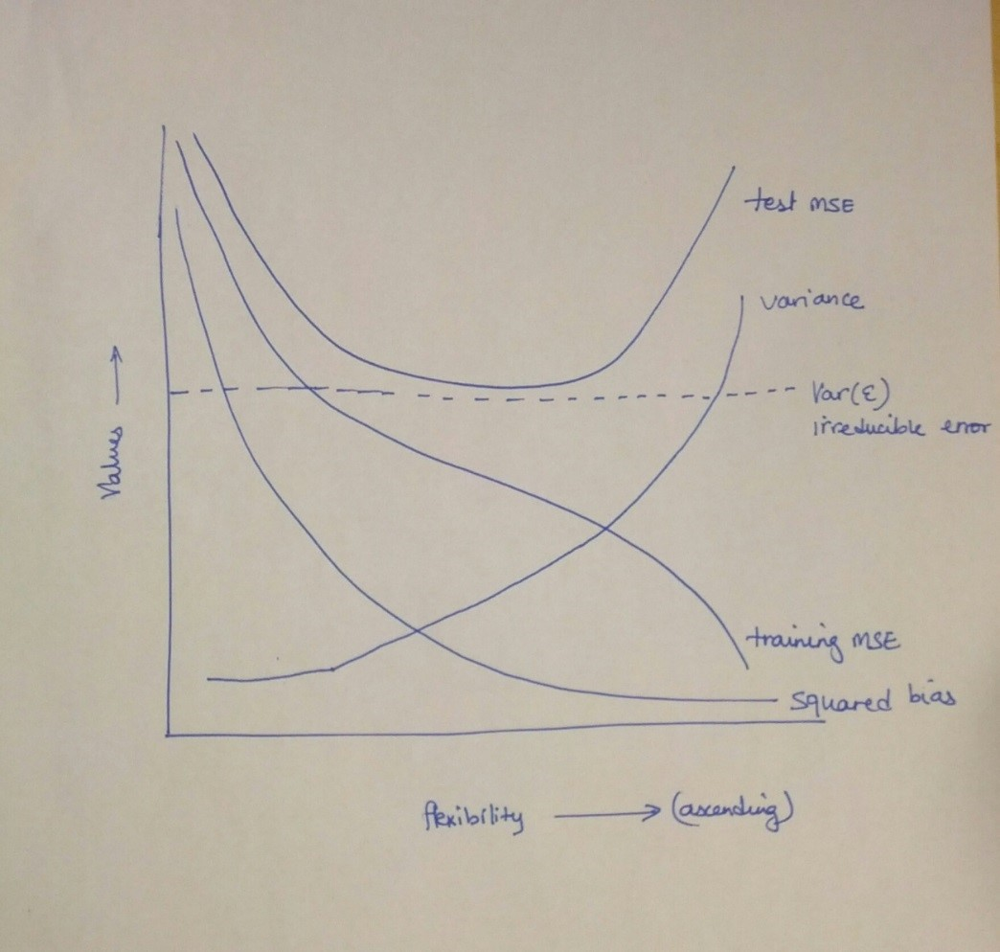

## Q1
For each of parts (a) through (d), indicate whether we would generally expect the performance of a flexible statistical learning method to be better or worse than an inflexible method. Justify your answer.

### 1.a
The sample size n is extremely large, and the number of predictors p is small.

**Better**. A flexible method will fit the data closer, and with the large sample size, would perform better than an inflexible approach.

### 1.b
The number of predictors p is extremely large, and the number of observations n is small.

**Worse**. A flexible method would overfit the small number of observations.

### 1.c
The relationship between the predictors and response is highly non-linear.

**Better**. With more degrees of freedom, a flexible method would fit better than an inflexible one.

### 1.d
The variance of the error terms, i.e. σ2 = Var(ε), is extremely high.

**Worse**. A flexible method would fit to the noise in the error terms and increase variance.

## Q2
Explain whether each scenario is a classification or regression problem, and indicate whether we are most interested in inference or prediction. Finally, provide $$n$$ and $$p$$.

### 2.a
We collect a set of data on the top 500 firms in the US. For each firm we record profit, number of employees, industry and the CEO salary. We are interested in understanding which factors affect CEO salary.

Regression and inference with $$n=500$$ and $$p=3$$.

### 2.b
We are considering launching a new product and wish to know whether it will be a success or a failure. We collect data on 20 similar products that were previously launched. For each prod- uct we have recorded whether it was a success or failure, price charged for the product, marketing budget, competition price, and ten other variables.

Classification and prediction with $$n=20$$ and $$p=13$$.

### 2.c
We are interesting in predicting the % change in the US dollar in relation to the weekly changes in the world stock markets. Hence we collect weekly data for all of 2012. For each week we record the % change in the dollar, the % change in the US market, the % change in the British market, and the % change in the German market.

Regression and prediction with $$n=52$$ and $$p=3$$.

## Q3
We now revisit the bias-variance decomposition.

### 3.a
Provide a sketch of typical (squared) bias, variance, training error, test error, and Bayes (or irreducible) error curves, on a single plot, as we go from less flexible statistical learning methods towards more flexible approaches. The x-axis should represent

### 3.b
Explain why each of the five curves has the shape displayed in part (a).

The **training MSE** declines monotonically as flexibility increases, this is because as the $$f$$ curve fits the observed data more closely.

The **test MSE** initially declines as flexibility increases, but at some point in levels off and then starts to increase again(U-shape), this is because when a $$f$$ curve yields a small training MSE but a large test MSE , we are atually overfitting the data.

The **sqared bias** decreases monotonically and the **variance** increases monotonically, as a generally rule, as we use more flexible methods, the variance will increase and the bias will decrease.

* **Variance** refers to the amount by which $$\hat f$$ would change if we estimated it using a different training data set, so if the curve fits the observations very closely, changing any point may cause $$\hat f$$ to change considerably, and so will result in some variance
* **Bais** refers to the error that is introduced by approximating a real-life problem by a much simpler model, so if we use a very simple model(linear regression) it is unlikely that any real-life problem has such a simple linear relationship, and so performing linear regression will result in some bias in the estimate of $$f$$.

The **irreducible error** is a constant so it is a parallel line, this curve lies below the test MSE curve because the expected test MSE alwaysbe greater than the $$Var(\epsilon)$$

## Q4

You will now think of some real-life applications for statistical learning.

### 4.a

Describe three real-life applications in which classification might be useful. Describe the response, as well as the predictors. Is the goal of each application inference or prediction ? Explain your answer.

Classification 1 - Is this TV series/movie/ad compagin going to be successful or not(Response: Success/Failure; Predictors: Money spent, Talent, Running Time, Producer, TV Channel, Air time slot, etc.; Goal: Prediction)

Classification 2 - Should this applicant be admintted into Havard University or not(Response: Admit/Not Admit; Predictors: SAT Scores, GPA, Socio Economic Strata, Income of parents, Essay effectiveness, Potential, etc.; Goal: Prediction)

Classification 3 - Salk Polio vaccine trials - Successful/Not Successful(Response: Did the child get polio or not; Predictors: Age, Geography, General health condition, Control/Test group, etc.; Goal: Prediction)

### 4.b

Describe three real-life applications in which regression might be useful. Describe the response, as well as the predictors. Is the goal of each application inference or prediction ? Explain your answer.

IGNORE

### 4.c

Describe three real-life applications in which cluster analysis might be useful.

IGNORE

## Q5

What are the advantages and disadvantages of a very flexible (versus a less flexible) approach for regression or classification? Under what circumstances might a more flexible approach be preferred to a less flexible approach? When might a less flexible approach be preferred?

The advantage of a very flexible approach are that it may give a better fit for non-linear models and it decreases the bias.

The disadvantage of a very flexible approach are that it requires estimating a greater number of parameters, it follows the noise too closely(overfit) and it increases the variance.

A more flexible approach would be preferred to a less flexible approach when we are interested in prediction and not the interpretability of the results.

A less flexible approach would be preferred to a more flexible approach when we are interested in inference and the interpretability of the results.

## Q6

Describe the differences between a parametric and a non-parametric statistical learning approach. What are the advantages of a para- metric approach to regression or classification (as opposed to a non- parametric approach)? What are its disadvantages?

A parametric approach reduces the problem of estimating $$f$$ down to one of estimating a set of parameters (将估计f问题降到了估计一组参数的问题)because it assumes a form for $$f$$.

A non-parametric approach does not assume a particular form for $$f$$ and so requires a very large sample to accurately estimate $$f$$.

The advantages of a parametric approach to regression or classification are the simplifying of modeling to a few parameters and not as many observations are required compared to a non-parametric approach.

The disadvantages of a parametric approach to regression or classification are a potentially inaccurate estimate $$f$$ if the form of $$f$$ assumed is wrong or to overfit the observations if more flexible models are used.

## Q7

The table below provides a training data set containing 6 observations, 3 predictors, and 1 qualitative response variable. Suppose we wish to use this data set to make a prediction for Y when X1 = X2 = X3 = 0 using K-nearest neighbors.

| Obs. | X_1  |  X_2 | X_3  | Y     |
| ---- | :--: | ---: | ---- | ----- |
| 1    |  0   |    3 | 0    | Red   |
| 2    |  2   |    0 | 0    | Red   |
| 3    |  0   |    1 | 3    | Red   |
| 4    |  0   |    1 | 2    | Green |
| 5    |  -1  |    0 | 1    | Green |
| 6    |  1   |    1 | 1    | Red   |

Suppose we wish to use this data set to make a prediction for Y when X1 = X2 = X3 = 0 using K-nearest neighbors.

### 7.a
Compute the Euclidean distance between each observation and the test point,$$X_1 =X_2 =X_3 =0$$.

| Obs. | X_1  |  X_2 |  X_3 | Y     | Distance |
| ---- | :--: | ---: | ---: | ----- | -------- |
| 1    |  0   |    3 |    0 | Red   | 3        |
| 2    |  2   |    0 |    0 | Red   | 2        |
| 3    |  0   |    1 |    3 | Red   | 3.16     |
| 4    |  0   |    1 |    2 | Green | 2.23     |
| 5    |  -1  |    0 |    1 | Green | 1.41     |
| 6    |  1   |    1 |    1 | Red   | 1.73     |

### 7.b
What is our prediction with $$K=1$$? Why?

If $$K=1$$ then $$x_5 \in N_0$$ and we have
$$
P(Y=Red|X=x_0)=\frac{1}{1}\sum_{i \in N_0}I(y_i = Red)=I(y_5=Red)=0
$$
and
$$
P(Y=Green|X=x_0)=\frac{1}{1}\sum_{i \in N_0}I(y_i = Green)=I(y_5=Green)=1
$$

### 7.c
What is our prediction with $$K=3$$? Why?

If $$K=3$$ then $$x_2, x_5, x_6 \in N_0$$ and we have
$$
P(Y=Red|X=x_0)=\frac{1}{3}\sum_{i \in N_0}I(y_i = Red)=\frac{1}{3}(1+0+1)=\frac{2}{3}
$$

and
$$
P(Y=Green|X=x_0)=\frac{1}{3}\sum_{i \in N_0}I(y_i = Green)=\frac{1}{3}(0+1+0)=\frac{1}{3}
$$

### 7.d

If the Bayes decision boundary in this problem is highly nonlinear, then would we expect the best value for K to be large or small? Why?

As $$K$$ becoms larger, the boundary becomes inflexible(linear), So in this case we would expect the best value for $$K$$ to be small.