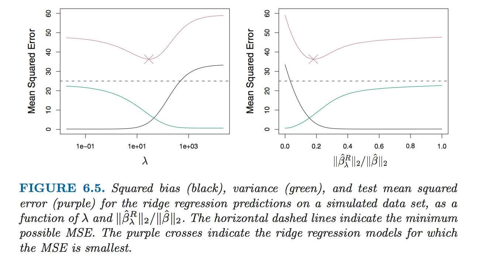

* The subset selection methods use least squares to fit a linear model that contains a subset of the predictors.
* As an alternative, we can fit a model containing all *p* predictors using a technique that *constrains* or *regularizes* the coefficient estimates, or equivalently, that *shrinks* the coefficient estimates towards zero.
* It may not be immediately obvious why such a constraint should improve the fit, but it turns out that shrinking the coefficient estimate can significantly reduce their variance.

## Ridge regression

### Basic knowledge

The ridge regression coefficient estimates $$\hat \beta^R$$ are the values that minimize
$$
\sum_{i=1}^n(y_i - \beta_0 - \sum_{j=1}^p\beta_jx_{ij}) + \lambda\sum_{j=1}^p\beta_j^2=RSS + \lambda\sum_{j=1}^p\beta_j^2
$$
where $$\lambda \gg 0$$ is a tuning parameter, to be determined separately.

* As with least squares, ridge regression seeks coefficient estimates that fit the data well, by making the RSS small.
* However, the second term, $$\lambda\sum_{j=1}^p\beta_j^2$$, called a *shrinkage penalty*, is small when $$\beta_0, \ldots,beta_p$$ are close to zero, and so it has the effect of *shrinking* the estimates of $$\beta_j$$ towards zero.
* The tuning parameter $$\lambda$$ serves to control the relative impact of these two terms on the regression coefficient estimates.
* Selecting a good value for $$\lambda$$ is critical; cross-validation is used for this. When $$\lambda=0$$, the penalty terms has no effect, and ridge regression will produce the least squares estimates.However, when $$\lambda \to \infty$$, the impact of the shrinkage penalty grows, and the ridge regression coefficients will approach zero.
* Unlike least squares, which generates only one set of coefficient estimates, **ridge regression will produce a different set of coefficient estimates $$\hat \beta_{\lambda}^R$$, for each value of $$\lambda$$**.

### Scaling of predictors

* The standard least squares coefficient estimates are *scale equivariant* multiplying $$X_j$$ by a constant $$c$$ simply leads to a scaling of the least squares coefficient estimates by a factor of $$1/c$$.

* In contrast, the ridge regression coefficient estimates can change substantially when multiplying a given predictor by a constant, due to the sum of squared coefficients term in the penalty part of the ridge regression objective function.

* Therefore, it is best to apply ridge regression after *standarding the predictors*, using the formula

$$
\tilde x_{ij} = \frac{x_{ij}}{\sqrt{\frac{1}{n}\sum_{i=1}^n(x_{ij}-\bar x_{j}^2)}}
$$

### Why Does Ridge Regression Improve Over Least Squares?

In general, in situations where the relationship between the response and the predictors is close to linear, the least squares estimates will have low bias but may have high variance.This means that a small change in the training data can cause a large change in the least squares coefficient estimates.

Ridge regression can still perform well by trading off a small increases in bias for a large decreases in variance. Hence, ridge regression works best in situations where the least squares estimates have high variance.

## The Lasso

Ridge regression does have one obvious disadvantage: unlike subset selection, which will generally select models that involve just a subset of the variables, ridge regression will include all $$p$$ predictors in the final model.

The Lasso is a relatively recent alternative to ridge regression that overcomes this disadvantage. The lasso coefficients, $$\hat \beta_{\lambda}^L$$, minimize the quantity
$$
\sum_{i=1}^n(y_i - \beta_0 - \sum_{j=1}^p\beta_jx_{ij}) + \lambda\sum_{j=1}^p|\beta_j|=RSS + \lambda\sum_{j=1}^p|\beta_j|
$$
As with ridge regression, the lasso shrinks the coefficient estimates towards zero. However, in the case of the lasso, the $$l_1$$ penalty has the effect of forcing some of the coefficient estimates to be exactly equal to zero when the tuning parameter $$\lambda$$ is sufficiently large.

We say that the lasso yields *sparse* selection - that is, models that involve only a subset of the variables. the lasso performs *variable selection*. As in ridge regression, selecting a good value of $$\lambda$$ for the lasso is critical; cross-validation is again the method of choice.

### The Variable Selection Property of the Lasso

Why is it that the lasso, unlike ridge regression, results in coefficient estimates that are exactly equal to zero?

One can show that the lasso and ridge regression coefficient estimates solve the problems
$$
minimize_{\beta}\sum_{i=1}^n(y_i - \beta_0 - \sum_{j=1}^p\beta_jx_{ij})^2 \qquad \text{subject to} \qquad \sum_{j=1}^p|\beta_j|\le s
$$
and
$$
minimize_{\beta}\sum_{i=1}^n(y_i - \beta_0 - \sum_{j=1}^p\beta_jx_{ij})^2 \qquad \text{subject to} \qquad \sum_{j=1}^p\beta_j^2\le s
$$

### Comparing the Lasso and Ridge Regression

* Neither ridge regression nor the lasso will universally dominate the other.
* In general, one might expect the lasso to perform better when the response is a function of only a relatively small number of predictors.
* However, the number of predictors that is related to the response is never know a priori for real data sets.
* A technique such as cross-validation can be used in order to determine which approach is better on a particular data set.

###  Selecting the Tuning Parameter for Ridge Regression and Lasso

* As for subset selection, for ridge regression and lasso we require a method to determine which of the models under consideration is best.
* That is, we require a method selecting a value for the tuning parameter $$\lambda$$ or equivalently, the value of the constraint $$s$$.
* *Cross-validation* provides a simple way to tackle this problem. We choose a grid of $$\lambda$$ values, and compute the cross-validation error rate for each value of $$\lambda$$.
* We then select the tuning parameter value for which the cross-validation error rate is smallest.
* Finally, the model is re-fit using all of the available observations and the selected value of the tuning parameter.
