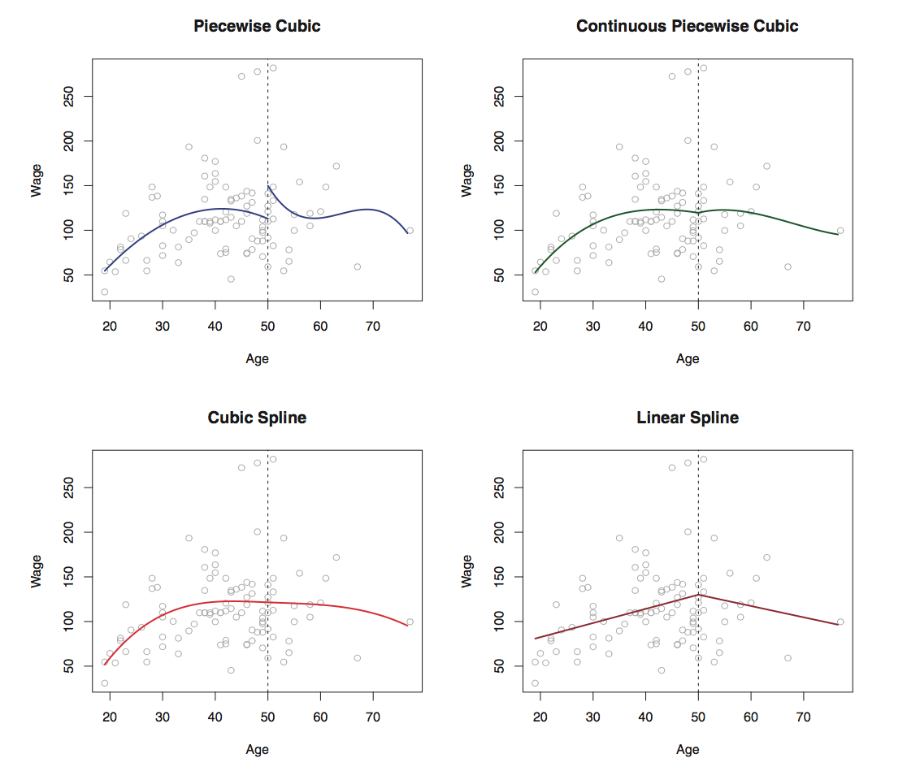

## Piecewise Polynomials

Instead of fitting a high-degree polynomial over the entire range of $$X$$, piecewise polynomial regression involves fitting separate low-degree polynomials over different regions of $$X$$.

A piecewise cubic  polynomial with a single knot at a point $$c$$ takes the form:
$$
y_i=
\left\{  
\begin{array}  
{l l}  
\beta_{01} + \beta_{11}x_i+\beta_{21}x_i^2+\beta_{31}x_i^3 +\epsilon_i \qquad x_i \gt c;\\  
\beta_{02} + \beta_{12}x_i+\beta_{22}x_i^2+\beta_{32}x_i^3 +\epsilon_i \qquad x_i \lt c;
\end{array}  
\right.
$$
Using more knots leads to a more flexible piecewise polynomial.But the function is discontinuous and looks ridiculous! Since each polynomial has four parameters, we are using a total of *eight degree of freedom* in fitting this piecewise polynomial model.

## Constraints and Splines

We can fit a piecewise polynomial under the constraint that the fitted curve must be continuous.

In the lowest left top, we have added two additional constraints: now both the first and second derivatives of the piecewise polynomials are continuous at `age=50`(not only continuous but also very smooth).

Each constraint that we impose on the piecewise cubic polynomials effectively frees up one degree of freedom, by reducing the complexity of the resulting piecewise polynomial fit. (我们对分段三项式施加的每个约束，通过降低分段多项式拟合的复杂度，能够有效的释放一个自由度). So in the top left plot, we are using eight degrees of freedom, but in the bottom left plot we imposed three constraints(continuity, continuity of the first derivative, and continuity of the second derivative) and so are left with five degrees of freedom.

The curve in the bottom left plot is called a **cubic spline**. In general, a cubic spline with $$K$$ knots uses a total of $$4+K$$ degrees of freedom.

## The Spline Basis Representation

We fit a piecewise degree-d polynomial under the constraint that it be continuous? It turns out that we can use the basis model to represent a regression spline. A cubic spline with $$K$$ knots can be modeled as:
$$
y_i=\hat \beta_0 + \hat \beta_1b_1(x_i) + \hat \beta_2b_2(x_i) + \ldots +\hat \beta_Kb_K(x_i) + \epsilon_i
$$
for an appropriate choice of basis functions $$b_1, b_2,\ldots, b_{K=3}$$.The model can then be fit using least squares.

In other words, in order to fit a cubic spline to a data set with $$K$$ knots, we perform least squares regression with an intercept and $$3+K$$ predictors, for this reason, fitting a cubic spline with $$K$$ knots uses $$K+4$$ degrees of freedom.

Unfortunately, spline can have high variance at the outer range of the predictors—that is, when $$X$$ takes on either a very small or very large value. A natural spline is a regression spline with additional boundary constraints: the function is required to be linear at the boundary .

## Choosing the Number and Locations of the Knots

When we fit a spline, where should we place the knots? The regression spline is most flexible in regions that contain a lot of knots, hence,

* One option is to place more knots in places where we feel the function might vary most rapidly, and to place fewer knots where it seems more stable.
* One way to do this is to specify the desired degrees of freedom, and then have the software automatically place the corresponding number of knots at uniform quantiles of the data.

How many knots should we use, or equivalently how many degrees of freedom should our spline contain?

* One option is to try out different numbers of knots and see which produces the best looking curve.
* A somewhat more objective approach is to use cross-validation. This procedure can be repeated for different numbers of knots $$K$$, then the value of $$K$$ giving the smallest RSS is chosen.

In Section 7.7, we fit additive spline models simultaneously on several variables at a time. This could potentially require the selection of degrees of freedom for each variables. In cases like this we typically adopt a more pragmatic approach and set the degrees of freedom to a fixed number, say four, for all terms.

## Comparison to Polynomial Regression

Regression splines often give superior results to polynomial regression. This is because unlike polynomials, which must use a high degree to produce flexible fits, splines introduce flexibility by increasing the number of knots but keeping the degree fixed.

Splines also allow us to place more knots, and hence flexibility, over regions where the function $$f$$ seems to be changing rapidly, and fewer knots where $$f$$ appears more stable.

The extra flexibility in the polynomial produces undesirable results at the boundaries, while the nature cubic spline still provides a reasonable fit to the data.